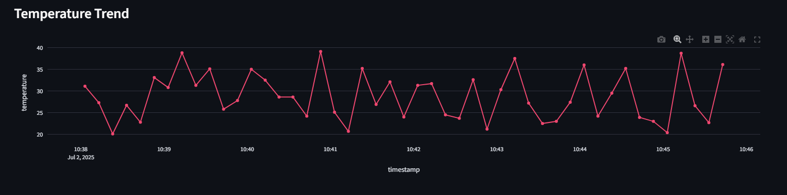
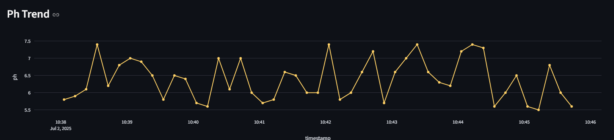
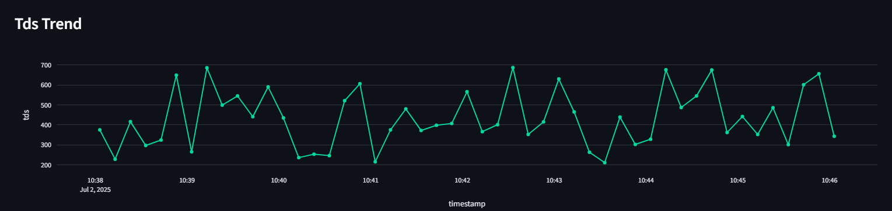
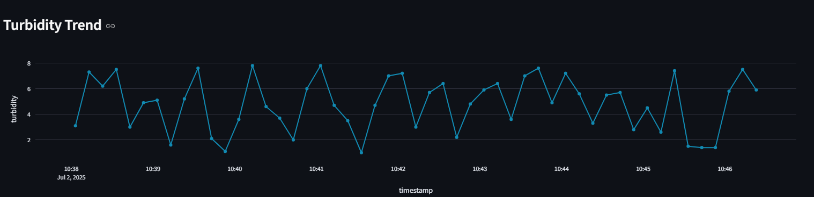
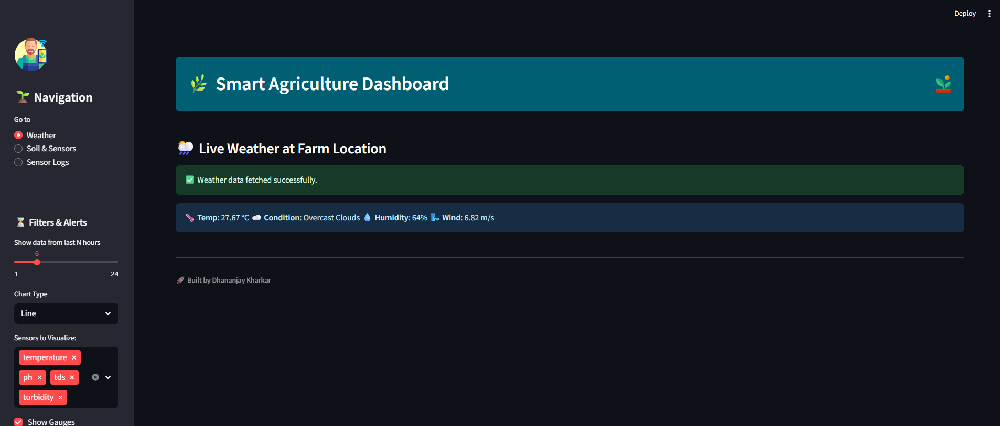
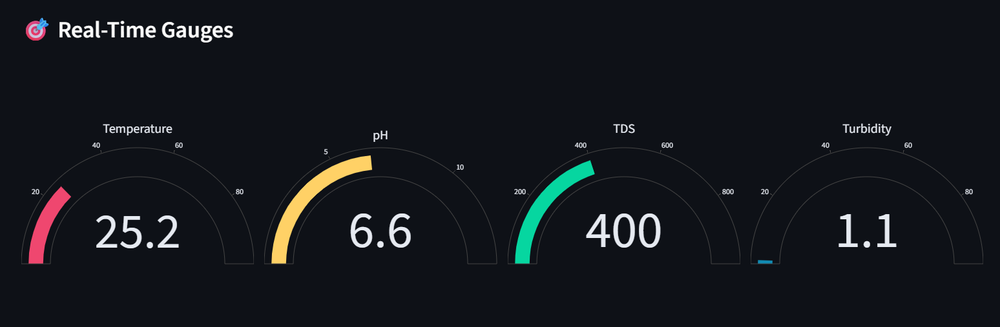
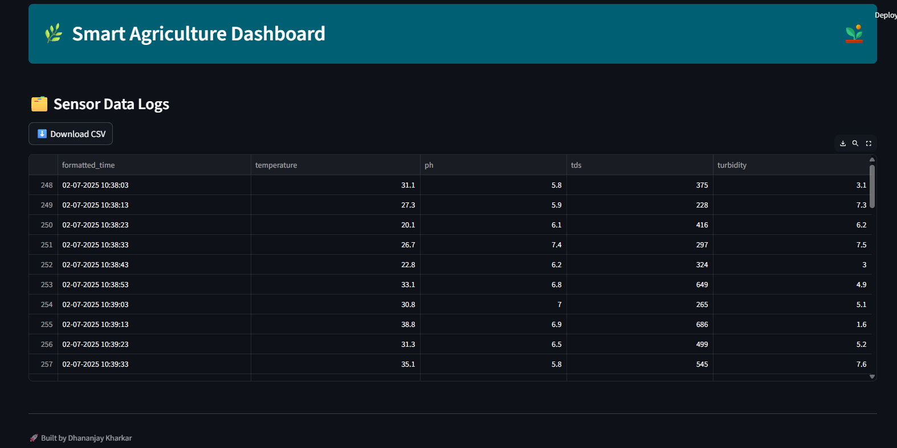

# 🌾 Real-Time Smart Agriculture Dashboard using ESP32, Firebase & Streamlit 📈🌱


---

## 📌 Project Overview

This project showcases a **real-time Smart Agriculture Monitoring System** built using **ESP32** (simulated data), **Firebase Realtime Database**, and a responsive **Streamlit Dashboard** for monitoring multiple soil and environmental parameters.

> 🔹 *Note: This project currently uses simulated values but is fully compatible with real sensor integrations like DS18B20, pH sensors, TDS probes, etc.*

---

## 💡 Tech Stack

* **ESP32** – Microcontroller simulating soil sensor values
* **Firebase Realtime Database** – Live cloud-based data backend
* **Streamlit** – Web-based interactive dashboard
* **Plotly** – Responsive sensor charts & gauges
* **OpenWeather API** – Live weather data from coordinates

---

## 🧭 System Architecture

```
ESP32 → Firebase Realtime DB → Streamlit Dashboard → Live Alerts & Visualization
                                       ↓
                          Auto-Refresh + Weather API
```

---

## 🔍 Key Highlights

- Real-time upload of simulated sensor data every 10 seconds  
- Firebase Email/Password secured data path  
- Professional Plotly charts: Line, Bar, Area  
- Gauge visualizations for each sensor  
- Live Weather API from farm GPS coordinates  
- Sidebar filters, alert thresholds, multi-page navigation  
- Downloadable logs in CSV format  
- Fully modular and customizable codebase  

---

## 📸 Screenshots

| Screenshot               | Description                          |
| ------------------------ | ------------------------------------ |
| `temperature_trends.png` | Live temperature trends of soil data |
| `ph_trends.png`          | Live pH level trends of soil data    |
| `tds_trends.png`         | Live TDS level trends of soil data   |
| `turbidity_trends.png`   | Live turbidity trends of soil data   |
| `weather_display.png`    | Real-time weather from OpenWeather   |
| `Gauge_display.png`      | Live gauge visualization             |
| `data_logs.png`          | Live data logs from Firebase         |

---

## ⚙️ Setup Instructions

### 1. ESP32 Code

```cpp
float temp = random(200, 400) / 10.0;
float ph = random(55, 75) / 10.0;
int tds = random(200, 700);
float turbidity = random(10, 80) / 10.0;
```

✅ ESP32 pushes the above values to Firebase under a structured format like:

```
/sensor_data/2025-07-01/<timestamp>/
    temperature: 28.7
    ph: 6.4
    tds: 510
    turbidity: 4.6
```

---

### 2. Firebase Setup

* Create Firebase Realtime Database
* Enable **Email/Password Authentication**
* Structure: `/sensor_data/<YYYY-MM-DD>/<UNIX_TIMESTAMP>`
* Add your credentials to both the ESP32 and Streamlit backend

---

### 3. Streamlit App Setup

```bash
pip install streamlit firebase-admin plotly streamlit-autorefresh pytz requests
streamlit run streamlit_app/dashboard.py
```

> Place your Firebase Admin SDK key as `serviceAccountKey.json` inside the `streamlit_app/` directory.

The dashboard auto-refreshes every 10s and displays live sensor + weather data.

---

## 🛡️ Alerting System

You can configure thresholds for each sensor via the Streamlit sidebar:

| Sensor      | Threshold Example  | Behavior           |
| ----------- | ------------------ | ------------------ |
| Temperature | `<10°C` or `>60°C` | Red alert          |
| pH          | `<5.5` or `>8.5`   | Abnormal condition |
| TDS         | `>800 ppm`         | High salt content  |
| Turbidity   | `>50 NTU`          | Cloudy water       |

---

## 🌦️ Live Weather

Integrated using [OpenWeatherMap API](https://openweathermap.org/current)
- Displays: Temperature, Humidity, Wind Speed, Weather Condition

---

## 📁 Project Structure

```
Smart-Agri-Dashboard/
│
├── esp32_code/                  
│   └── main/
│       └── main.ino              → ESP32 simulated data code
├── streamlit_app/
│   ├── dashboard.py              → Streamlit dashboard code
│   └── serviceAccountKey.json    → Firebase credentials
├── screenshots/                  → UI screenshots for README
├── README.md
└── LICENSE
```

---

## 🧩 Visuals

<h3>📈 Sensor Trends</h3>





<h3>🌦️ Weather API</h3>


<h3>🎯 Gauge Display</h3>


<h3>🗂️ Firebase Data Logs</h3>


---

## 🛠️ Future Enhancements

* Replace simulation with real sensors (DS18B20, pH probe, etc.)
* Add historical analysis, z-score anomaly detection
* Integrate GPS-based map view for farm sensors
* Build mobile-friendly Progressive Web App
* Add Telegram/WhatsApp/Email alerting pipeline

---

## 🤝 Feedback & Collaboration

I'm open to suggestions, collaborations, and discussions.
Connect with me via [LinkedIn](https://www.linkedin.com/in/dhananjaykharkar/) or raise an issue in this repository.

---

⭐ If you like this project, please consider starring the repo!

🪪 License
This project is licensed under the MIT License – see the [LICENSE](LICENSE) file for details.

---

Let me know if you want a `.gitignore`, ZIP folder for upload, or video walkthrough embed in the README.
